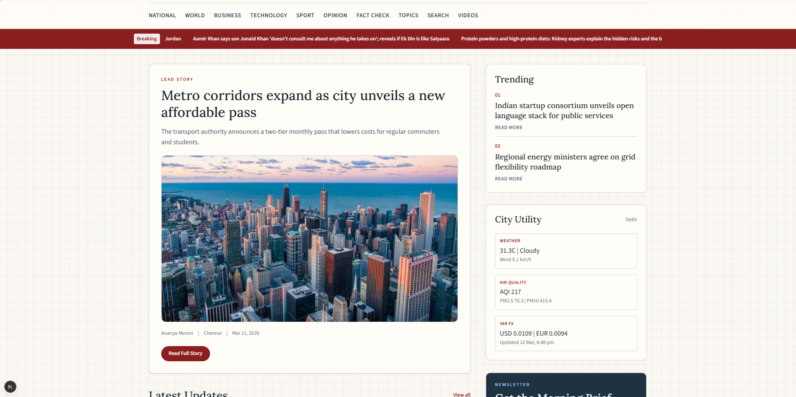
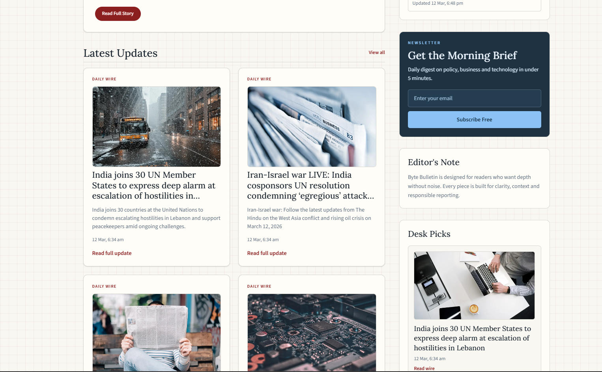
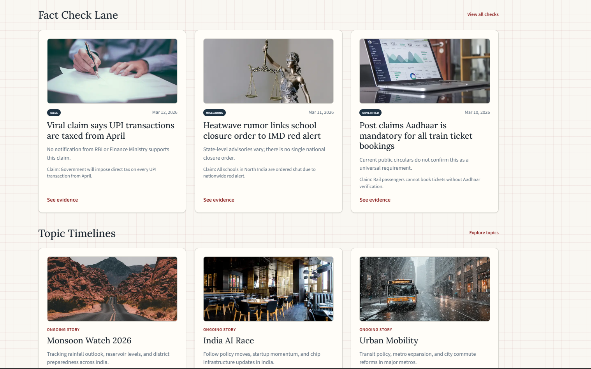
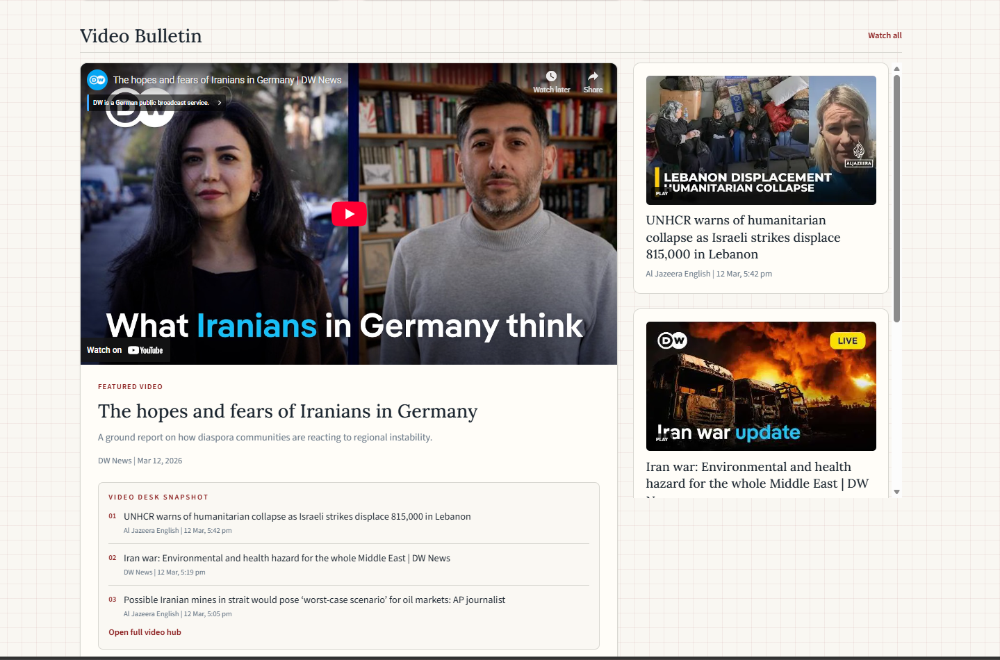
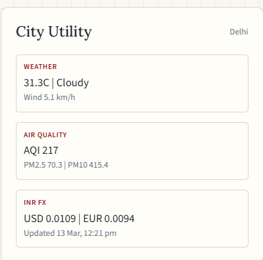

# Byte Bulletin

Byte Bulletin is an India-first, free-resource news platform built with Next.js. It combines daily headlines, video bulletin feeds, fact-check lanes, topic timelines, and editorial trust blocks.

## GitHub Overview

- Built for portfolio + production-style newsroom workflows
- Works with free tiers (Sanity, Vercel, GNews, YouTube RSS)
- Includes fallback local data, so it runs even without CMS setup
- Designed for high readability, large typography, and mobile-friendly layout

## Key Features

- Daily headline feed (`GNews`) with breaking ticker
- Video Bulletin with auto-updated YouTube RSS cards
- Fact Check Lane with verdict labels and evidence links
- Topic timelines for ongoing stories
- Article trust panel: why it matters, what changed, what next, sources, last verified
- Read-in-60-sec summaries + browser audio playback
- Daily Briefs (Morning + Evening), Explainer card, and local saved stories
- Utility widgets (weather, AQI, INR forex)

## Screenshots

### Homepage



### Latest Updates



### Fact Check Lane



### Video Bulletin



### City Utility



### Newsletter Panel


## Tech Stack

- Next.js 16 (App Router + TypeScript)
- Tailwind CSS
- Sanity CMS (free tier)
- Vercel-ready deployment

## Getting Started

1. Install dependencies

```bash
npm install
```

2. Create local environment file

```bash
cp .env.example .env.local
```

Windows PowerShell alternative:

```powershell
Copy-Item .env.example .env.local
```

3. Start development server

```bash
npm run dev
```

Open `http://localhost:3000`.

## Environment Variables

Use these in `.env.local`:

```bash
NEXT_PUBLIC_SITE_URL=http://localhost:3000
NEXT_PUBLIC_SANITY_PROJECT_ID=your_project_id
NEXT_PUBLIC_SANITY_DATASET=production
GNEWS_API_KEY=your_gnews_api_key
YOUTUBE_NEWS_CHANNEL_IDS=UCNye-wNBqNL5ZzHSJj3l8Bg,UCknLrEdhRCp1aegoMqRaCZg
```

## Sanity CMS Setup (Free)

1. Create an account at `https://www.sanity.io`.
2. Create project + dataset.
3. Add project values in `.env.local`.
4. Open Studio at `http://localhost:3000/studio`.

If Sanity is not configured, Byte Bulletin serves fallback local content automatically.

## Routes

- `/` home page
- `/news/[slug]` article page
- `/category/[slug]` category page
- `/search` search page
- `/videos` video bulletin page
- `/fact-check` fact-check lane
- `/topics` topic timeline index
- `/topic/[slug]` topic timeline detail
- `/studio` Sanity Studio
- `/api/daily-news` cached GNews feed
- `/api/daily-videos` cached YouTube RSS feed

## Scripts

```bash
npm run dev
npm run build
npm run start
npm run lint
npm run sanity
```

## Free Growth Checklist

- Deploy on Vercel Hobby
- Connect Google Search Console
- Add newsletter using free tier providers
- Expand editorial stories in Sanity for non-repeating homepage cards
